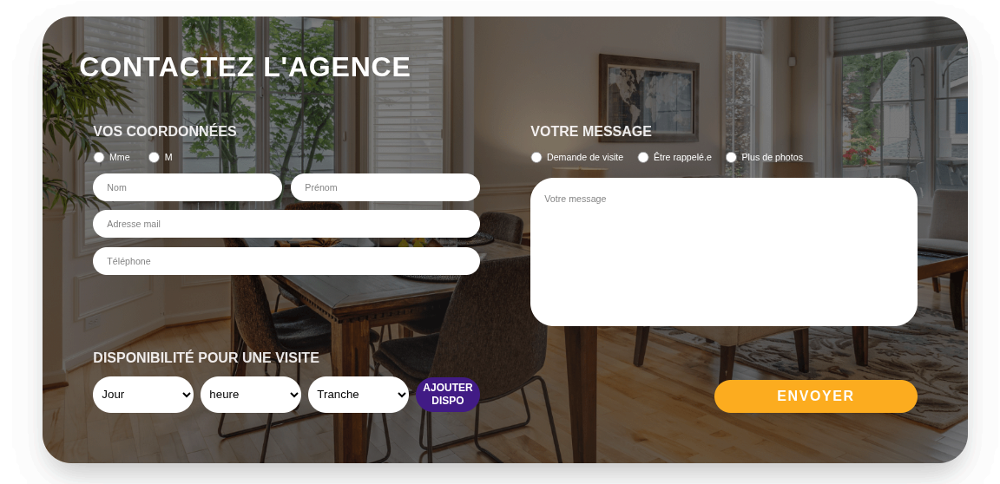
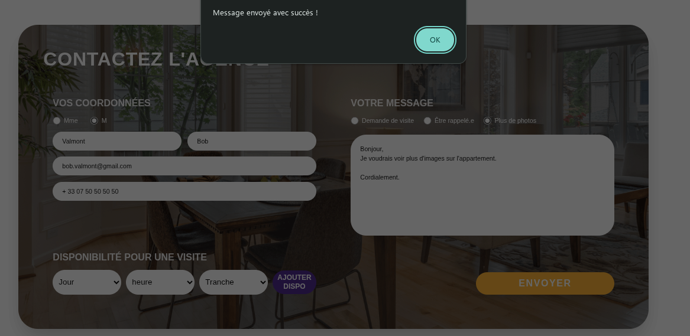

# Mon Tremplin

## Infos Perso
    Guzelbaba Imran
    2ème Année BUT Informatique
    8-10 semaines de stage, de 20 Avril à 19 Juin
    Liens:
        - https://github.com/ImranGuzelbaba
        - https://www.linkedin.com/in/imran-guzelbaba-770a103a4/

## Screenshots
- 
- 

## Stack technique & choix
    - Framework: Next.js, version 15. Choisi pour la facilité de faire le front-end et back-end dans un seul projet
    - Design : Tailwind CSS. Utilisé pour reproduire fidèlement la maquette, avec simplicité grâce aux classes qu'on intègre dans les balises html.
    - BDD: MySQL. Hébergé sur AlwaysData, choisi pour ma familiarité avec le sql (utilisé dans les projets pendant mes études).
    - Connexion: MySQL2. Communication rapide entre la BDD et l'application.

## Lancement du projet
    1) BASH #> git clone https://github.com/ImranGuzelbaba/mon-tremplin.git && cd mon-tremplin
    2) BASH #> npm install
    3) Créer un "/.env.local" avec ces lignes en remplaçant les crochets par vos identifiants:
        - DATABASE_HOST=[LIEN HÔTE]
        - DATABASE_USER=[UTILISATEUR BDD]
        - DATABASE_PASSWORD=[MOT DE PASSE BDD]
        - DATABASE_NAME=[NOM BDD]
    4) Exécuter le fichier "/schema.sql" dans votre gestionnaire de BDD (Comme PhpMyAdmin)
    5) BASH #> npm run dev
    6) Ouvrir dans un navigateur le lien: http://localhost:3000

## Questions
    - L'exercice était très intéressant, car je n'ai jamais utilisé de framework comme Next.js, ayant utilisé le MVC comme architecture, donc philosophie différente entre les deux, c'était instructif.
    - Nouveaux outils: Next.js, Tailwind CSS.
    - Pour le 2ème année du BUT, on a eu un gros projet qui a durée entre Septembre et Mars sur la création d'un site web intéractif (escape game sur la thématique de la cybersécurité et cryptographie). On a notamment utilisé l'architecture MVC, c'est celle qu'on a le plus utilisé.
    - Gemini-cli (3.0). Je l'ai utilisé pour m'expliquer le fonctionnement de Next.js avec la création des pages, controlleurs et la syntaxe de Tailwind CSS. J'ai fait la partie design et création de la BDD avec la connexion vers cette dernière.
