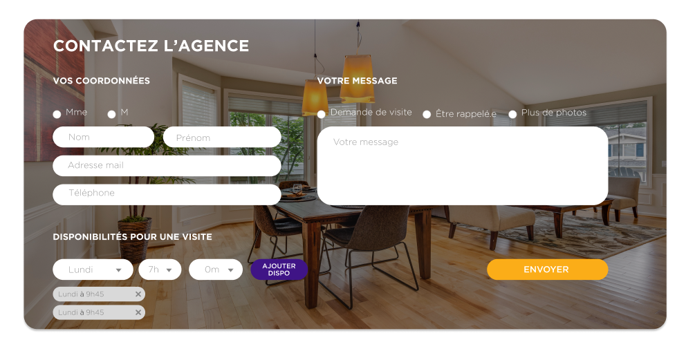

# Mon Tremplin

## Infos Perso
    Guzelbaba Imran
    2ème Année BUT Informatique
    8-10 semaines de stage, de 20 Avril à 19 Juin
    Liens:
        - https://github.com/ImranGuzelbaba
        - https://www.linkedin.com/in/imran-guzelbaba-770a103a4/

## Screenshots
- Des **screenshots** de la page principale réalisée

## Stack technique & choix
    - Next.js, version
    - Outils et librairies principales utilisées (UI, dates, formulaires, etc.) avec 1 phrase pour expliquer chaque choix

## Lancement du projet
- Une section **“Lancement du projet”**

## Questions
- Avez-vous trouvé l’exercice facile ou difficile ? Qu’est-ce qui vous a posé problème ?
    - Avez-vous appris de nouveaux outils pour répondre à l’exercice ? Si oui, lesquels ?
    - Quelle est la place du développement web dans votre cursus de formation ?
    - Avez-vous utilisé un LLM ? Si oui, comment intégrez vous les LLM à chaque étape de votre workflow ? 
    - Gemini-cli (3.0)
---

